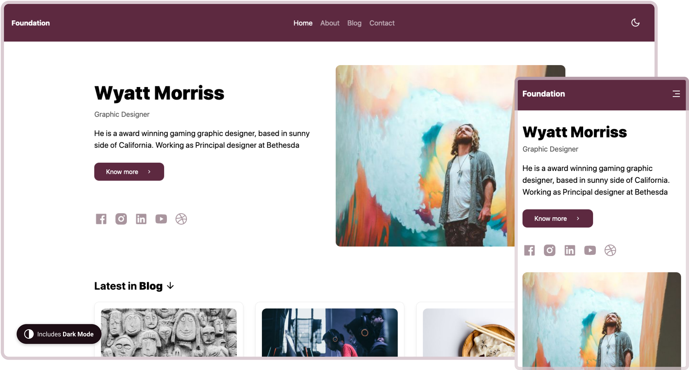
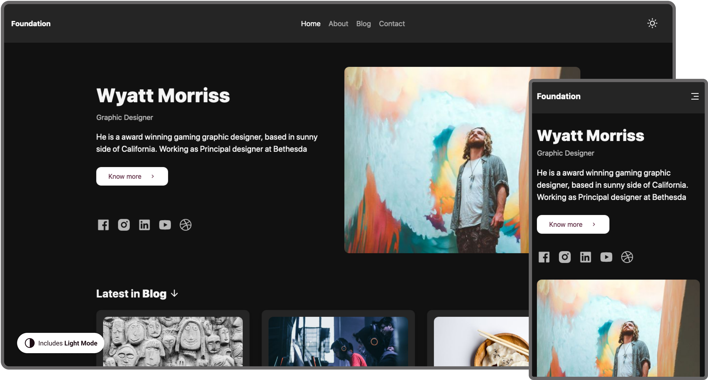
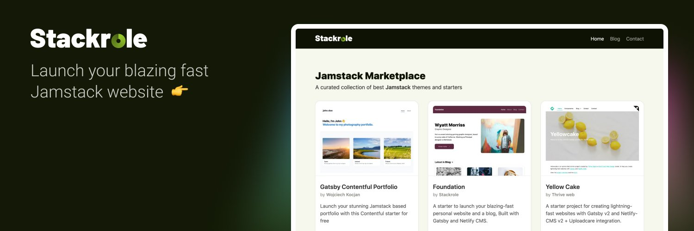

> **Update** Foundation is now built with Gatsby V3, this include many performance update

---

[](https://app.netlify.com/sites/frosty-perlman-9da1cb/deploys) &nbsp;<a href="https://twitter.com/intent/follow?screen_name=stackrole">
  
</a>

# Foundation

A starter to launch your blazing fast personal website and a blog, Built with [Gatsby][gatsby] and [Netlify CMS][netlifyCMS].

[](https://app.netlify.com/start/deploy?repository=https://github.com/stackrole/gatsby-starter-foundation)

Need help launching your website? My DM's are open on <a href="https://twitter.com/stackrole">twitter</a>

[](https://stackrole.com/jamstack/foundation/)

## 👌 Features
- A Blog and Personal website with Netlify CMS.
- Responsive Web Design
- Dark / Light Mode
- Customize content of Homepage, About and Contact page.
- Add / Modify / Delete blog posts.
- Edit website settings, Add Google Analytics and make it your own all with in the CMS.
- SEO Optimized
- Social media icons
- OpenGraph structured data
- Twitter Cards meta
- Beautiful XML Sitemaps
- Netlify Contact Form, Works right out of the box after deployment.
- Invite collaborators into Netlify CMS, without giving access to your Github account via Git Gateway
- Gatsby Incremental Builds with Netlify.


[](https://foundation.stackrole.com)

## 🚀 Quick Deploy
Just click on the **Deploy to Netlify** button.

[](https://app.netlify.com/start/deploy?repository=https://github.com/stackrole/gatsby-starter-foundation)

This would fork `gatsby-starter-foundation` to your Github account and start building your website on [Netlify](https://netlify.com). Once the deployment is done. Your website will be live and website address would look like **site-name.netlify.app**

### Further Instructions
- [Access to Netlify CMS](#access-to-netlify-cms)
- [Editing content and Adding posts](#editing-content-and-adding-posts)
- [Customing Site details](#customing-site-details)
- [Adding Custom domain to netlify website](#adding-custom-domain-to-netlify-website)
- [Install Locally](#install-locally)
- [Folder Structure](#folder-structure)
- [Learning Gatsby](#learning-gatsby)
- [Thank you from Stackrole](#thank-you)

## ⚙ Access to Netlify CMS
- Goto app.netlify.com > select your website from the list
- Goto identity and Click **Enable Identiy**
- Click on **Invite Users** and invite yourself. You will receive an email and you need to accept the invitation to set the password.
- Now headover to Settings > Identity > Services and **Enable Git Gateway**
- You can also manage who can register and log in to your CMS. Goto  Settings > Identity > Registration >Registration Preferences. I would prefer to keep it to **Invite Only**, if i am the only one using it.
- Now, goto to **site-name.netlify.app/admin/**, and login with your credentials.

## 📝 Editing content and Adding posts
Once you are in your Netlify CMS, you can navigate to Posts and Pages. Here you will find a list of existing pages and posts. 

You can select any existing post or page to start editing or add a **New Post**. Have fun :)

## ⚙ Customing Site details
You can find all the website settings such website Site title, Website URL, Google anlaytics etc,.. in your Netlify CMS `Admin > Settings > General`


## 🌐 Adding Custom domain to netlify website
We have written a short article on [Custom domain with Netlify website](custom-domain)

## 🖥 Install Locally
Use the Gatsby CLI to create a new site, specifying the `gatsby-starter-foundation` starter.
```bash
gatsby new gatsby-starter-foundation https://github.com/stackrole/gatsby-starter-foundation
```
> You need Node and Gatsby-CLI installed, check out Gatsby [Setup Instructions](https://www.gatsbyjs.org/tutorial/part-zero/)

### Start developing
Navigate into your new site’s directory and start it up.
```shell
cd my-hello-world-starter/
gatsby develop
```

**Open the source code and start editing!**

Your site is now running at `http://localhost:8000`!

_Note: You'll also see a second link: _`http://localhost:8000/___graphql`_. This is a tool you can use to experiment with querying your data. Learn more about using this tool in the [Gatsby tutorial](https://www.gatsbyjs.org/tutorial/part-five/#introducing-graphiql)._

Open the `gatsby-starter-foundation` directory in your code editor of choice and edit. Save your changes and the browser will update in real time!

You can use Netlify CMS in you local just run `npx netlify-cms-proxy-server` and start run `gatsby develop`

## 📁 Folder Structure

A quick look at the top-level files and directories you'll see in a Gatsby project.

    .
    ├── node_modules
    ├── src
    ├── .gitignore
    ├── .prettierrc
    ├── gatsby-browser.js
    ├── gatsby-config.js
    ├── gatsby-node.js
    ├── LICENSE
    ├── package-lock.json
    ├── package.json
    └── README.md

1.  **`/node_modules`**: This directory contains all of the modules of code that your project depends on (npm packages) are automatically installed.

2.  **`/src`**: This directory will contain all of the code related to what you will see on the front-end of your site (what you see in the browser) such as your site header or a page template. `src` is a convention for “source code”.

3.  **`.gitignore`**: This file tells git which files it should not track / not maintain a version history for.

4.  **`.prettierrc`**: This is a configuration file for [Prettier](https://prettier.io/). Prettier is a tool to help keep the formatting of your code consistent.

5.  **`gatsby-browser.js`**: This file is where Gatsby expects to find any usage of the [Gatsby browser APIs](https://www.gatsbyjs.org/docs/browser-apis/) (if any). These allow customization/extension of default Gatsby settings affecting the browser.

6.  **`gatsby-config.js`**: This is the main configuration file for a Gatsby site. This is where you can specify information about your site (metadata) like the site title and description, which Gatsby plugins you’d like to include, etc. (Check out the [config docs](https://www.gatsbyjs.org/docs/gatsby-config/) for more detail).

7.  **`gatsby-node.js`**: This file is where Gatsby expects to find any usage of the [Gatsby Node APIs](https://www.gatsbyjs.org/docs/node-apis/) (if any). These allow customization/extension of default Gatsby settings affecting pieces of the site build process.

8.  **`LICENSE`**: Gatsby is licensed under the MIT license.

9. **`package-lock.json`** (See `package.json` below, first). This is an automatically generated file based on the exact versions of your npm dependencies that were installed for your project. **(You won’t change this file directly).**

10. **`package.json`**: A manifest file for Node.js projects, which includes things like metadata (the project’s name, author, etc). This manifest is how npm knows which packages to install for your project.

11. **`README.md`**: A text file containing useful reference information about your project.

## 🎓 Learning Gatsby

Looking for more guidance? Full documentation for Gatsby lives [on the website](https://www.gatsbyjs.org/). Here are some places to start:

- **For most developers, we recommend starting with our [in-depth tutorial for creating a site with Gatsby](https://www.gatsbyjs.org/tutorial/).** It starts with zero assumptions about your level of ability and walks through every step of the process.

- **To dive straight into code samples, head [to our documentation](https://www.gatsbyjs.org/docs/).** In particular, check out the _Guides_, _API Reference_, and _Advanced Tutorials_ sections in the sidebar.


## 🙏 Thank you
We really appreciate you taking time to build your website with our `gatsby-starter-foundation`. 

I would love to get your feedback and contributions. 

Feel free to ping [@stackrole](stackrole) for help regarding your JAMstack website, our DM's are open. And do not forget to share you website with me 😊

[](https://stackrole.com)

[gatsby]: https://gatsbyjs.org
[netlifyCMS]: https://www.netlifycms.org
[stackrole]: https://stackrole.com
[twitter]: https://twitter.com/stackrole
[custom-domain]: https://stackrole.com/adding-custom-domain-netlify
